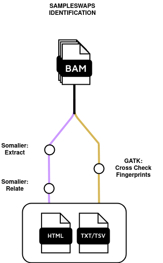

# nextflow_swaps_identification

Pipeline to checks that all data in the set comes from the same individual.



## Overview
This document describes the usage of a Nextflow workflow designed for checking wether the samples being used come from the same individual or are not related. Two different tools can be run together or independently. From GATK, tool crosscheckfingerprints and for somalier, extract + relate. This workflow is configured to be run with Docker, Singularity, Conda containers, ensuring reproducibility across different computing environments.

## Prerequisites
- Nextflow >=22.10.1
- Singularity
- Docker

## Installation
Clone this repository:
```bash
git clone this repository URL
cd  nextflow_pharmacogenomics
```

## Parameters Description
- --outdir results: Specifies the output directory where the results will be saved.
- --input Path to the input CSV file containing sample information.
- --tools crosscheckfingerprints,somalier
- --fasta Path to the reference genome in FASTA format.
- --fai Path to the index FASTA reference genome.
- --sites Path to file of known polymorphic sites in VCF format.
- --haplomap  Path to haplotype blocks defined in the HAPLOTYPE_MAP file to enable it to have higher statistical power for detecting identity or swap by aggregating data from several SNPs in the haplotype block. 


## Running the Workflow
To successfully run the workflow, different input parameters are required:

```bash
nextflow run main.nf \
-profile singularity \
--tools crosscheckfingerprints,somalier \
--input /path/to/assets/samplesheet.csv \
--outdir results \
--fasta /path/to/reference.fasta \
--fai /path/to/reference.fasta.fai \
--sites /path/to/SOMALIER/sites.hg38.vcf.gz \
--haplomap /path/to/haplotypemap/haplotype_map.txt
```
## Input Files
The format of the input file (samplesheet.csv) should contain the following header. The pipeline can be run with cram or bam input reads, so either one of those should be stated in the input.csv file:

- sample: name of the experiment
- bam: path to the aligned read
- bai: path to the indexed aligned read
- cram: path to the aligned read
- crai: path to the indexed aligned read
